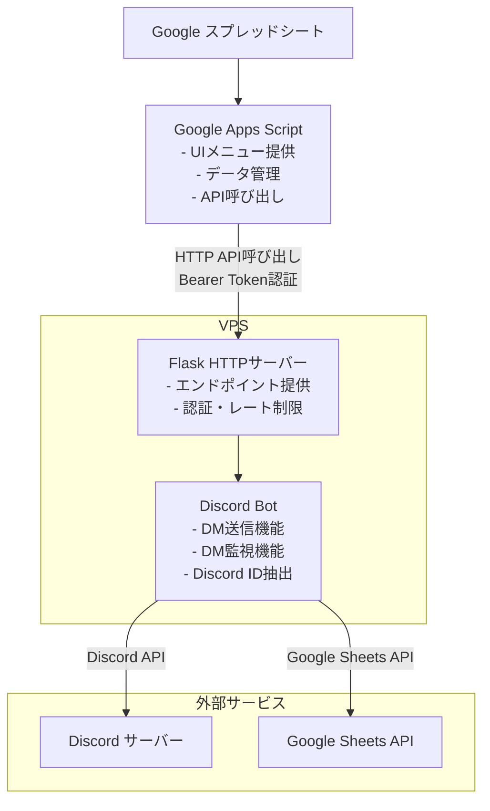
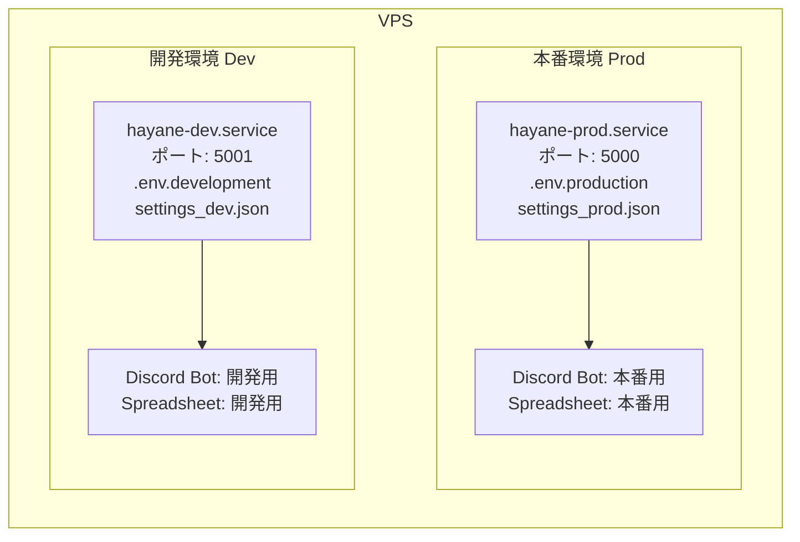
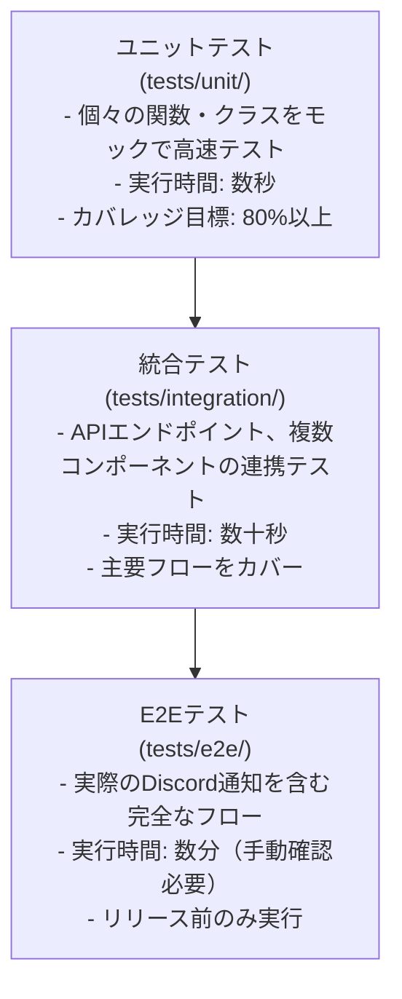

# Discord交流促進Bot

経営者コミュニティにおける会員同士の交流促進を、Discord DM機能とGoogleスプレッドシートを活用して自動化するシステムです。

## 📋 目次

1. [システム概要](#システム概要)
2. [システム構成](#システム構成)
3. [主要機能](#主要機能)
4. [環境分離（開発・本番）](#環境分離開発本番)
5. [クイックスタート](#クイックスタート)
6. [テスト・CI/CD](#テストcicd)
7. [プロジェクト構造](#プロジェクト構造)
8. [関連ドキュメント](#関連ドキュメント)

---

## システム概要

### 目的

運営者が手動で行っていたDiscord DMによる会員紹介業務を自動化し、Googleスプレッドシートで管理・記録できるようにします。

### 特徴

- ✅ **モジュール化アーキテクチャ**: メンテナンスしやすい構成
- ✅ **1コマンド起動**: `python main.py`だけで全機能が稼働
- ✅ **Googleスプレッドシート連携**: 直感的なUI で紹介データを管理
- ✅ **重複チェック機能**: 同じ組み合わせの紹介を自動検出
- ✅ **Discord ID直接指定**: 表示名変更の影響を受けない安定した送信
- ✅ **DM監視機能**: サーバーメンバーからの返信を自動転送
- ✅ **Discord ID抽出**: GAS経由で単発確認・一括更新が可能
- ✅ **送信前確認**: 1行ずつ内容を確認してから送信
- ✅ **エラーハンドリング**: 詳細なエラーログと管理者への通知

---

## プロジェクト構造

```
hayane/
├── main.py                         # メインエントリーポイント
├── wsgi.py                         # WSGIエントリーポイント
├── modules/                        # 機能モジュール
│   ├── __init__.py                 # モジュール初期化
│   ├── config.py                   # 設定管理・環境変数検証
│   ├── bot_core.py                 # Discord Botコア
│   ├── dm_handler.py               # DM監視機能
│   ├── discord_id_handler.py       # Discord ID抽出
│   ├── sheets_handler.py           # Google Sheets操作
│   ├── stats_manager.py            # 統計情報管理
│   └── api_handler.py              # Flask API
├── systemd/                        # systemdサービス設定
│   ├── hayane-dev.service          # 開発環境用
│   ├── hayane-prod.service         # 本番環境用
│   ├── install.sh                  # インストールスクリプト
│   └── diagnose.sh                 # 診断スクリプト
├── docs/                           # ドキュメント
│   ├── api-specification.md        # API仕様書
│   ├── security-specification.md   # セキュリティ仕様書
│   ├── setup-guide.md              # セットアップガイド
│   ├── operation-guide.md          # 運用ガイド
│   ├── developer-guide.md          # 開発者ガイド
│   └── cicd-guide.md               # CI/CDガイド
├── tests/                          # テストコード
│   ├── __init__.py                 # テストパッケージ初期化
│   ├── unit/                       # ユニットテスト
│   ├── integration/                # 統合テスト
│   ├── e2e/                        # E2Eテスト
│   ├── fixtures/                   # テスト用フィクスチャ
│   ├── conftest.py                 # pytest共通フィクスチャ
│   └── README.md                   # テストドキュメント
├── logs/                           # ログファイル（自動生成）
│   ├── dm/                         # DM監視ログ（JSONL形式）
│   └── stats/                      # 統計ログ
├── .github/
│   └── workflows/
│       ├── tests.yml               # CI（自動テスト）
│       └── deploy-manual.yml       # CD（手動デプロイ）
├── Code.gs                         # Google Apps Script
├── setup_existing_spreadsheet.py   # スプレッドシート初期設定
├── pytest.ini                      # pytest設定ファイル
├── requirements.txt                # Pythonパッケージ依存関係
├── .env.example                    # 環境変数テンプレート
├── .env.development                # 開発環境用設定（Git管理外）
├── .env.production                 # 本番環境用設定（Git管理外）
├── settings_dev.json               # 開発環境用Google認証情報（Git管理外）
├── settings_prod.json              # 本番環境用Google認証情報（Git管理外）
└── README.md                       # このファイル
```

---

## システム構成

### 全体アーキテクチャ



### 技術スタックと役割分担

| コンポーネント | 技術 | 役割 |
|---|---|---|
| **フロントエンド** | Google Apps Script | UIメニュー、データ管理、API呼び出し |
| **バックエンド** | Python + Flask | API提供、Discord Bot制御 |
| **Discord連携** | discord.py | DM送信、DM監視、メンバー管理 |
| **データ管理** | Google Sheets API | スプレッドシート操作 |
| **サービス管理** | systemd | プロセス管理、自動起動 |

---

## 主要機能

### 1. DM送信機能

- スプレッドシートから紹介者・被紹介者情報を読み取り
- Discord DMで自動送信
- 送信前の1行ずつ確認
- 重複チェック（順方向・逆方向）
- 送信結果の自動記録

### 2. DM監視機能

- サーバーメンバーからのDM返信を自動検知
- 管理チャンネルへ自動転送
- ログファイルへの記録

### 3. Discord ID管理

- **単発確認**: 表示名からIDを取得
- **一括更新**: 顧客管理シートから一括でID取得・更新
- 表示名変更に影響されない安定した送信

### 4. 統計管理

- 送信成功/失敗の記録
- 統計情報の集計
- 履歴データの管理

### 5. エラーハンドリング

- 詳細なエラーログ
- 管理者への自動通知
- エラー内容のスプレッドシート記録

---

## 環境分離（開発・本番）

### 概要

開発環境と本番環境を完全に分離して運用できるように設計されています。

**環境分離の目的**:
- 開発中の変更が本番に影響しない
- 本番データの保護
- 開発版と本番版の同時稼働が可能

### VPS内の環境構成



### 主要な分離項目

| 設定項目 | 開発環境 | 本番環境 |
|---------|---------|---------|
| **Discord Bot** | 開発用Botトークン | 本番用Botトークン |
| **スプレッドシート** | 開発用シートID | 本番用シートID |
| **サービスアカウント** | settings_dev.json | settings_prod.json |
| **ポート** | 5001 | 5000 |
| **ログレベル** | debug | info |

### セキュリティ機構

8層の防御機構により、環境の混同を**構造的に不可能**にしています。

詳細は[セキュリティ仕様書](./docs/security-specification.md)を参照してください。

---

## クイックスタート

### 前提条件

- Python 3.9以上
- Googleアカウント
- Discord Botアカウント
- VPS（Virtual Private Server）

### 基本的なセットアップフロー

```
1. Discord Botを作成
   ↓
2. Google Cloud Platformでサービスアカウントを作成
   ↓
3. スプレッドシートを作成・共有
   ↓
4. 環境変数を設定（.env.development / .env.production）
   ↓
5. Google Apps Scriptを設定
   ↓
6. サービスを起動
```

### 起動方法

#### systemd経由（推奨）

```bash
# 開発環境を起動
sudo systemctl start hayane-dev.service

# 本番環境を起動
sudo systemctl start hayane-prod.service

# 状態確認
sudo systemctl status hayane-prod.service
```

#### 直接実行（開発・テスト用）

```bash
# プロジェクトディレクトリに移動
cd /path/to/hayane

# 仮想環境を有効化
source .venv/bin/activate

# 開発環境で起動（APP_ENV必須）
APP_ENV=development python main.py
```

### 動作確認

```bash
# ヘルスチェック
curl http://localhost:5000/api/health
```

期待されるレスポンス:
```json
{
  "status": "ok",
  "timestamp": "2025-10-24T12:00:00",
  "bot_status": "ready"
}
```

**詳細なセットアップ手順は[セットアップガイド](./docs/setup-guide.md)を参照してください。**

---

## テスト・CI/CD

### 🧪 テスト戦略

このプロジェクトでは、**pytest** を使用した3層のテスト戦略を採用しています：



### ローカルテストの実行

```bash
# ユニットテストのみ（高速、カバレッジなし）
make test-unit

# ユニット + 統合テスト（カバレッジなし）
make test

# カバレッジレポート生成（ユニット + 統合）
make coverage

# カバレッジレポート表示（ブラウザで開く）
make coverage-view
```

### 📦 CI/CD パイプライン

#### 🚀 クイックデプロイ

1. **GitHubのActionsタブにアクセス**
2. **「Manual Deploy to VPS」を選択**
3. **「Run workflow」をクリック**
4. **デプロイ先を選択**（production / development）
5. **実行完了を確認**（約30秒〜1分）

#### CI（継続的インテグレーション）

**自動実行**: `git push` 時に自動的に実行されます。

```
git push
   ↓
GitHub Actions (自動)
   ├─ ユニットテスト
   ├─ 統合テスト
   ├─ Lintチェック (flake8, black, isort)
   ├─ セキュリティチェック (bandit, safety)
   └─ カバレッジレポート生成
```

#### CD（継続的デプロイ）

**手動実行**: GitHubのActionsタブから手動でデプロイを実行します。

```
GitHub Actions (手動)
   ├─ VPSにSSH接続
   ├─ git pull
   ├─ 依存関係更新（requirements.txt変更時）
   └─ systemctl restart（環境別）
```

---

## 関連ドキュメント

詳細な情報は以下のドキュメントを参照してください：

### 📘 仕様書

- **[API仕様書](./docs/api-specification.md)**: 全エンドポイントの詳細仕様、リクエスト/レスポンス例
- **[セキュリティ仕様書](./docs/security-specification.md)**: 8層の防御機構、レート制限、アクセスログ管理

### 📗 ガイド

- **[セットアップガイド](./docs/setup-guide.md)**: Discord Bot作成からVPS設定まで詳細な手順
- **[運用ガイド](./docs/operation-guide.md)**: 日常的な運用方法、DM送信手順、トラブル対応
- **[開発者ガイド](./docs/developer-guide.md)**: プロジェクト構造、モジュール詳細、開発環境構築

### 🧪 テスト・CI/CD

- **[テストREADME](./tests/README.md)**: pytest テストスイートの詳細、実行方法
- **[CI/CDガイド](./docs/cicd-guide.md)**: CI/CDパイプラインの詳細、デプロイ手順、トラブルシューティング

### 🔒 セキュリティ

- `.env.development`、`.env.production`、`settings_dev.json`、`settings_prod.json`は**絶対にGitにコミットしない**
- API Keyは3-6ヶ月ごとに変更
- アクセスログを定期的に確認

---
