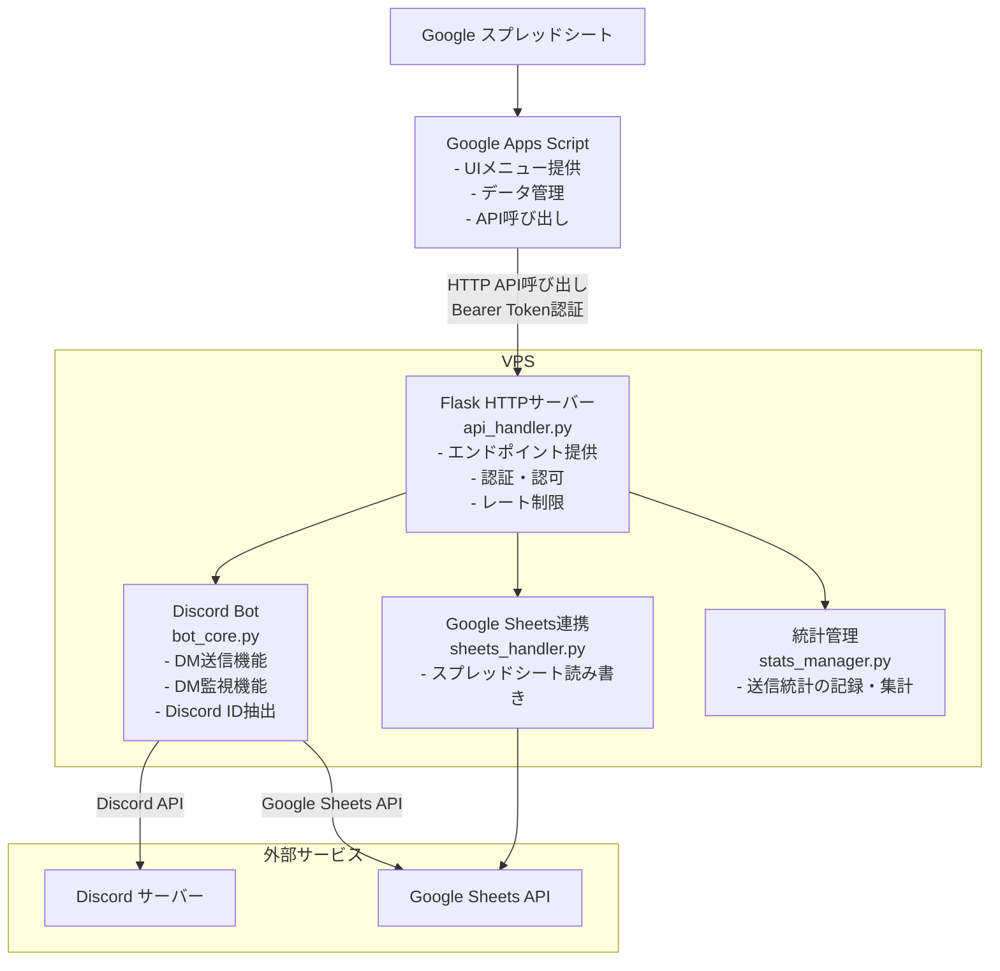
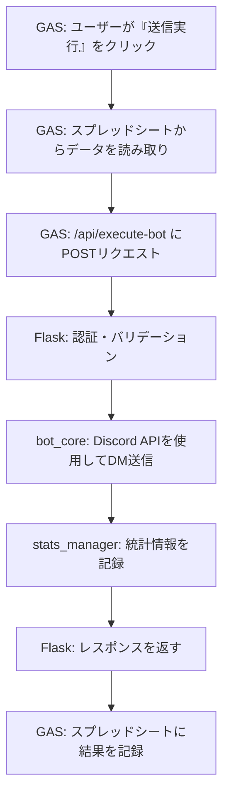
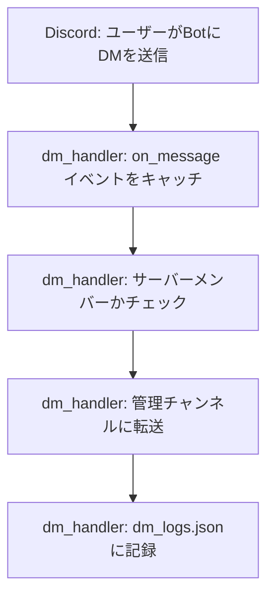

# 開発者ガイド

Discord交流促進Botの開発者向け技術情報を説明します。

## 目次

1. [プロジェクト構造](#プロジェクト構造)
2. [アーキテクチャ](#アーキテクチャ)
3. [モジュール詳細](#モジュール詳細)
4. [開発環境のセットアップ](#開発環境のセットアップ)
5. [コーディング規約](#コーディング規約)
6. [テスト](#テスト)
7. [デバッグ](#デバッグ)
8. [新機能の追加](#新機能の追加)
9. [デプロイ](#デプロイ)
10. [トラブルシューティング](#トラブルシューティング)

---

## プロジェクト構造

```
hayane/
├── main.py                         # メインエントリーポイント
├── wsgi.py                         # WSGIエントリーポイント
├── modules/                        # 機能モジュール
│   ├── __init__.py                 # モジュール初期化
│   ├── config.py                   # 設定管理・環境変数検証
│   ├── bot_core.py                 # Discord Botコア・DM送信
│   ├── dm_handler.py               # DM監視・管理チャンネル転送
│   ├── discord_id_handler.py       # Discord ID抽出・更新
│   ├── sheets_handler.py           # Google Sheets操作
│   ├── stats_manager.py            # 統計情報管理
│   └── api_handler.py              # Flask API・エンドポイント定義
├── systemd/                        # systemdサービス設定
│   ├── hayane-dev.service          # 開発環境用サービス
│   ├── hayane-prod.service         # 本番環境用サービス
│   ├── install.sh                  # インストールスクリプト
│   └── diagnose.sh                 # 診断スクリプト
├── docs/                           # ドキュメント
│   ├── api-specification.md        # API仕様書
│   ├── security-specification.md   # セキュリティ仕様書
│   ├── setup-guide.md              # セットアップガイド
│   ├── operation-guide.md          # 運用ガイド
│   ├── developer-guide.md          # このファイル
│   └── cicd-guide.md               # CI/CDガイド
├── tests/                          # テストコード
│   ├── __init__.py                 # テストパッケージ初期化
│   ├── conftest.py                 # pytest共通フィクスチャ
│   ├── README.md                   # テストドキュメント
│   ├── unit/                       # ユニットテスト
│   ├── integration/                # 統合テスト
│   ├── e2e/                        # E2Eテスト
│   └── fixtures/                   # テスト用フィクスチャ
├── logs/                           # ログファイル（自動生成）
│   ├── dm/                         # DM監視ログ（JSONL形式）
│   └── stats/                      # 統計ログ
├── .github/
│   └── workflows/
│       ├── tests.yml               # CI（自動テスト）
│       └── deploy-manual.yml       # CD（手動デプロイ）
├── Code.gs                         # Google Apps Scriptコード
├── setup_existing_spreadsheet.py   # スプレッドシート初期設定
├── pytest.ini                      # pytest設定ファイル
├── requirements.txt                # Pythonパッケージ依存関係
├── .env.example                    # 環境変数テンプレート
├── .env.development                # 開発環境用設定（Git管理外）
├── .env.production                 # 本番環境用設定（Git管理外）
├── settings_dev.json               # 開発環境用Google認証情報（Git管理外）
├── settings_prod.json              # 本番環境用Google認証情報（Git管理外）
├── .gitignore                      # Git除外設定
└── README.md                       # プロジェクト概要
```

---

## アーキテクチャ

### 全体構成



### 処理フロー

#### DM送信フロー



#### DM監視フロー



---

## モジュール詳細

### config.py

**役割**: 環境変数の読み込みと検証

**主要機能**:
- 環境変数の読み込み（`.env.{APP_ENV}`）
- 必須環境変数の検証
- 環境識別子の検証
- 8層の防御機構の実装

**主要関数**:
```python
def validate_config() -> None:
    """設定の検証を実行"""
    
def load_env_file(env: str) -> None:
    """環境別の.envファイルを読み込み"""
```

**環境変数**:
```python
APP_ENV = os.getenv("APP_ENV")  # development or production
DISCORD_TOKEN = os.getenv("DISCORD_TOKEN")
GUILD_ID = int(os.getenv("GUILD_ID"))
SPREADSHEET_ID = os.getenv("SPREADSHEET_ID")
SERVICE_ACCOUNT_FILE = os.getenv("SERVICE_ACCOUNT_FILE")
API_KEY = os.getenv("API_KEY")
STATS_API_TOKEN = os.getenv("STATS_API_TOKEN")
# ... その他の環境変数
```

---

### bot_core.py

**役割**: Discord Botのコア機能

**主要機能**:
- Discord Botの初期化
- DM送信
- サーバーメンバーの取得
- Bot状態の管理

**主要クラス・関数**:
```python
class DiscordBot(discord.Client):
    """Discord Botクライアント"""
    
    async def on_ready(self):
        """Bot起動時の処理"""
        
    async def send_dm(self, user_id: int, message: str) -> dict:
        """DMを送信"""

def get_bot() -> DiscordBot:
    """Botインスタンスを取得"""
    
def run_bot() -> None:
    """Botを起動（ブロッキング）"""
    
def is_bot_ready() -> bool:
    """Botが準備完了かチェック"""
```

**使用例**:
```python
from modules.bot_core import get_bot

bot = get_bot()
result = await bot.send_dm(123456789, "こんにちは！")
```

---

### dm_handler.py

**役割**: DM監視と管理チャンネルへの転送

**主要機能**:
- DM受信イベントの監視
- サーバーメンバーのチェック
- 管理チャンネルへの転送
- ログファイルへの記録

**主要関数**:
```python
def register_dm_handler(bot: discord.Client) -> None:
    """DM監視ハンドラを登録"""
    
async def on_message(message: discord.Message) -> None:
    """メッセージ受信時の処理"""
```

**ログフォーマット**:
```json
{
  "timestamp": "2025-10-24T12:00:00",
  "user_id": "123456789012345678",
  "user_name": "Hayane",
  "message": "メッセージ内容",
  "forwarded": true
}
```

---

### discord_id_handler.py

**役割**: Discord ID抽出とスプレッドシート更新

**主要機能**:
- サーバーメンバーリストから表示名でユーザーを検索
- Discord IDの取得
- スプレッドシートへの一括更新

**主要関数**:
```python
async def get_discord_id_by_display_name(
    display_name: str, 
    guild: discord.Guild
) -> Optional[str]:
    """表示名からDiscord IDを取得"""
    
async def update_all_discord_ids(
    guild: discord.Guild, 
    spreadsheet_id: str
) -> dict:
    """全Discord IDを一括更新"""
```

---

### sheets_handler.py

**役割**: Google Sheets操作

**主要機能**:
- スプレッドシートの読み書き
- サービスアカウント認証
- データの取得・更新

**主要関数**:
```python
def get_sheets_service():
    """Google Sheets APIサービスを取得"""
    
def read_sheet(spreadsheet_id: str, range_name: str) -> list:
    """シートからデータを読み取り"""
    
def write_sheet(
    spreadsheet_id: str, 
    range_name: str, 
    values: list
) -> None:
    """シートにデータを書き込み"""
```

---

### stats_manager.py

**役割**: 統計情報の管理

**主要機能**:
- 送信統計の記録
- 統計情報の集計
- 履歴データの管理

**主要クラス・関数**:
```python
class StatsManager:
    """統計情報マネージャー"""
    
    def record_send(self, success: bool) -> None:
        """送信結果を記録"""
        
    def get_current_stats(self) -> dict:
        """現在の統計情報を取得"""
        
    def get_history(
        self, 
        days: Optional[int] = None,
        from_date: Optional[str] = None,
        to_date: Optional[str] = None
    ) -> list:
        """履歴データを取得"""
```

---

### api_handler.py

**役割**: Flask APIの提供

**主要機能**:
- HTTPエンドポイントの定義
- 認証・認可
- レート制限
- エラーハンドリング

**主要エンドポイント**:
```python
@app.route('/')
def index():
    """API情報"""

@app.route('/api/health')
def health():
    """ヘルスチェック"""

@app.route('/api/execute-bot', methods=['POST'])
@require_api_key
@limiter.limit("80 per minute")
def execute_bot():
    """DM送信実行"""

@app.route('/api/stats')
@require_stats_token
@limiter.limit("80 per minute")
def get_stats():
    """統計情報取得"""
```

**認証デコレータ**:
```python
def require_api_key(f):
    """API Key認証を要求"""
    @wraps(f)
    def decorated_function(*args, **kwargs):
        auth_header = request.headers.get('Authorization')
        if not auth_header or not auth_header.startswith('Bearer '):
            return jsonify({'error': 'Unauthorized'}), 401
        token = auth_header.split(' ')[1]
        if token != API_KEY:
            return jsonify({'error': 'Invalid API Key'}), 401
        return f(*args, **kwargs)
    return decorated_function
```

---

## 開発環境のセットアップ

### 1. リポジトリのクローン

```bash
git clone https://github.com/your-username/hayane.git
cd hayane
```

### 2. 仮想環境の作成

```bash
python3 -m venv .venv
source .venv/bin/activate
```

### 3. 依存パッケージのインストール

```bash
pip install -r requirements.txt
```

### 4. 環境変数の設定

```bash
cp .env.example .env.development
# .env.developmentを編集して必要な値を設定
```

### 5. 開発環境の起動

```bash
APP_ENV=development python main.py
```

---

## テスト

### テストの実行

```bash
# 全テストを実行
python -m pytest tests/

# 特定のテストファイルを実行
python -m pytest tests/test_api_operation_notifications.py

# カバレッジ付きで実行
python -m pytest --cov=modules tests/
```

### テストの作成

```python
import pytest
from modules.bot_core import get_bot

@pytest.mark.asyncio
async def test_send_dm():
    """DM送信のテスト"""
    bot = get_bot()
    result = await bot.send_dm(123456789, "テストメッセージ")
    assert result["status"] == "success"
```

---

## デバッグ

### ログレベルの設定

開発環境では`LOG_LEVEL=debug`を設定します。

```bash
# .env.development
LOG_LEVEL=debug
```

### ログの確認

```bash
# リアルタイムログ
sudo journalctl -u hayane-dev.service -f

# 最新100行
sudo journalctl -u hayane-dev.service -n 100
```

### デバッグ用エンドポイント

```python
# テスト通知
curl -X POST http://localhost:5001/api/test-notifications \
  -H "Authorization: Bearer $API_KEY" \
  -H "Content-Type: application/json" \
  -d '{"type": "health_check"}'

# テストエラー
curl -X POST http://localhost:5001/api/test-dm-errors \
  -H "Authorization: Bearer $API_KEY" \
  -H "Content-Type: application/json" \
  -d '{"error_type": "user_dm_disabled"}'
```

---
